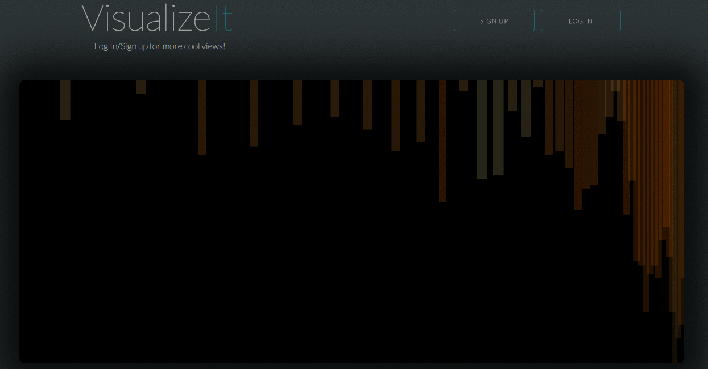

# VisualizeIt
An application that will use your devices microphone to take the sound it hears, digitally sample the audio, and render a fun visual representation of the audio signal in multiple frequencies.

***Instructions***
As the page loads it will ask you for your permission to use your devices microphone....Click Yes!
- You can stay at the homepage and use the default Visualizer, or sign up, and log in to have more options.

After you Sign In / Sign Up:
1. Click on the "Select Visual" dropdown menu
2. Choose your new Visualizer
3. Last click "Visualize" to display the new Visual

***Technologies Used***

HTML, CSS, Skeleton, SVG, Javascript, D3, Ruby (Some Rails Technology), Sinatra, and Postgresql.

***Next Update***
- Audio URL input to play a song through the application.
- Sine Wave Generator
- Drum Machine
- More Visualizers!!

***Links***

* [VisualizeIt](http://visualize-it.herokuapp.com/)
* [My Github](https://github.com/developernick)
